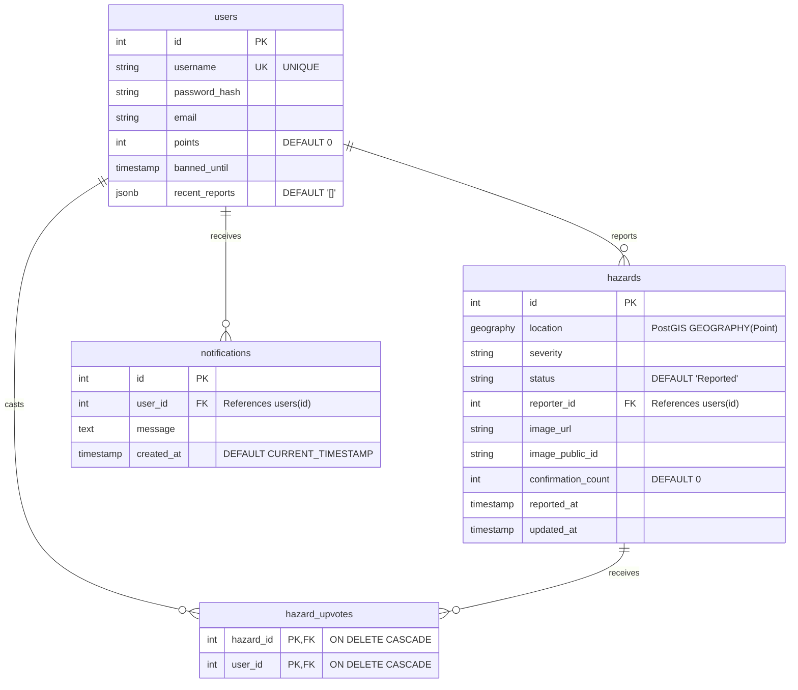

# PaveSafe AI - Database ER Diagram

The following Entity-Relationship (ER) diagram visualizes the PostgreSQL database schema for the PaveSafe AI platform based on the backend source code migrations and queries.

