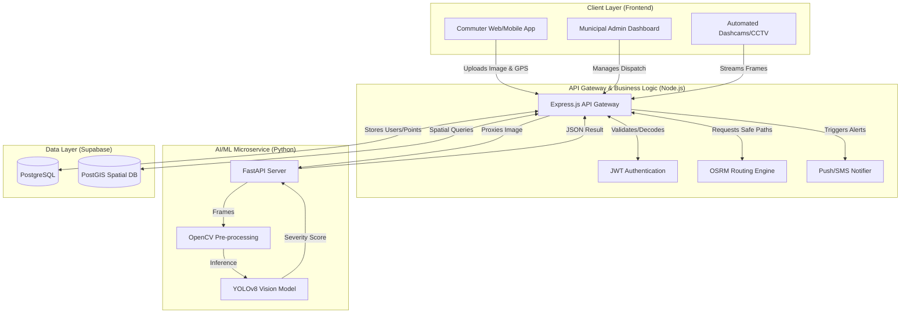

# PaveSafe AI - System Architecture & Design Document

## 1. System Overview
**PaveSafe AI** is an intelligent, crowdsourced infrastructure maintenance and commuter safety platform. It bridges the gap between citizens reporting road hazards (potholes, structural damage) and municipal authorities repairing them. By leveraging deep learning (YOLOv8) for automated severity classification and geospatial databases (PostGIS) for mapping, PaveSafe optimizes the entire lifecycle of road maintenance while keeping commuters safe via real-time alerts and safe-route navigation.

---

## 2. High-Level Architecture
The system is built on a modern, decoupled **3-Tier Microservice Architecture** to ensure high availability, scalability, and separation of concerns.

---

## 3. Core Components & Technology Stack

### 3.1. Client Layer (Frontend)
* **Framework:** Next.js (React), Tailwind CSS
* **Mapping:** React-Leaflet integrated with OpenStreetMap (OSM) Tiles.
* **Modules:**
  * **Commuter App:** Allows citizens to capture photos, grabs hardware GPS coordinates, and displays safe alternative routes. Includes a gamified profile showing "Citizen Points" earned for valid reports.
  * **Admin Dashboard:** A secured portal for municipal workers. Features a heat-map view of hazards, statistical analytics, and status toggle buttons (Reported → In Progress → Resolved).

### 3.2. Backend API (Node.js / Express)
* **Framework:** Node.js with Express.js
* **Responsibilities:**
  * Acts as the central nervous system.
  * Handles JWT-based authentication and role-based access control (Citizens vs. Admins).
  * Communicates with the OSRM (Open Source Routing Machine) to calculate safe paths avoiding `Critical` hazard clusters.
  * Manages the gamification logic (crediting points when an admin resolves a user's reported hazard).

### 3.3. AI / Machine Learning Microservice (Python)
* **Framework:** FastAPI, PyTorch, OpenCV
* **Model:** YOLOv8 (You Only Look Once) / Mask R-CNN.
* **Responsibilities:**
  * Receives image payloads via multipart/form-data.
  * Performs rapid inference to detect the presence of a pothole.
  * Analyzes bounding box depth/area to assign a **Severity Score** (Low, Medium, Critical).
  * Completely containerized via Docker for independent scaling (GPU scaling).

### 3.4. Data Layer (Supabase / PostgreSQL)
* **Database:** PostgreSQL extended with **PostGIS**.
* **Why PostGIS?** Standard databases struggle with coordinate math. PostGIS allows the backend to run complex spatial queries instantly, such as: 
  * *"Find all 'Critical' potholes within a 5km radius of these coordinates."*
  * *"Check if a user's generated route intersects with a hazard zone."*

---

## 4. System Flows & Use Cases

### Flow A: The Reporting Lifecycle (Citizen → AI → Database)
1. Citizen opens the PaveSafe Commuter App and takes a photo of a pothole.
2. The browser's `navigator.geolocation` API attaches precise Lat/Lng coordinates.
3. The image and metadata are POSTed to the Node.js API.
4. Node.js forwards the image in memory to the Python FastAPI microservice.
5. The YOLOv8 model analyzes the image, confirms it is a pothole, and flags it as `Critical`.
6. Node.js receives the `Critical` flag, converts the Lat/Lng into a PostGIS spatial point (`ST_SetSRID`), and inserts the record into the database with status `Reported`.

### Flow B: Proximity Alerts & Navigation
1. A user enters a destination in the Commuter app.
2. The Node.js backend queries OSRM for standard routes.
3. The backend runs a PostGIS `ST_DWithin` query to check if the standard routes pass through un-resolved `Critical` hazard clusters.
4. If a collision is detected, the backend calculates an alternative path or issues a Push Notification warning the driver to reduce speed.

### Flow C: Municipal Resolution & Gamification
1. City administrators log into the dashboard and view the hazard Heatmap.
2. They identify a cluster of `Critical` hazards and dispatch a crew, changing the status to `In Progress`.
3. Once repaired, the admin clicks `Mark Resolved`.
4. The backend fires a trigger that identifies the original citizen who reported the hazard, sends them an SMS thanking them, and adds +50 "Safe Citizen" points to their gamified profile.

---

## 5. Security & Scalability Considerations
* **Stateless Authentication:** All API endpoints are secured using JSON Web Tokens (JWT).
* **Decoupled Architecture:** The AI model requires heavy compute (GPUs), while the Node API requires high I/O (handling thousands of user requests). Separating them into two distinct microservices allows the city to scale the AI containers independently from the web servers.
* **Dockerization:** Both the Node.js and Python services are fully containerized with isolated `Dockerfile` configurations, ensuring seamless deployment to any cloud provider (AWS, GCP, Render).
